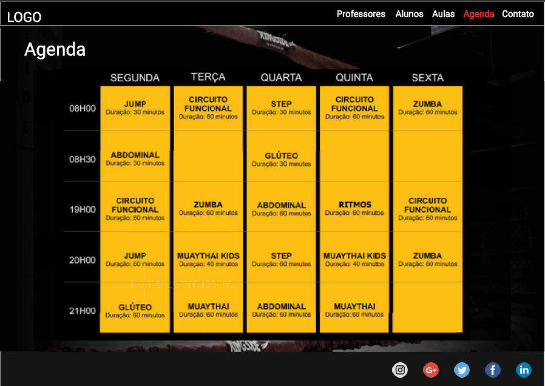

# SGA - Sistema de Gerenciamento de Academias
    
## Integrantes:
ANDERSON ALEXANDRE AMICUCHI MACHADO  
ANDRE HENRIQUE AURELIANO  
ANDRE MARCOS ACCORONI THEODORO  
GUILHERME GALBIATI DA CRUZ  
LILIAN HELENA DA SILVA  
LUIS FELLIPE ALVES SILVA  
RUBENS DOS SANTOS VIEIRA JUNIOR    

## Tema escolhido pelo grupo
  
   
## Título provisório do trabalho
   SGA - Sistema de Gerenciamento de Academias    
   
## Problema
   Dificuldade no gerenciamento de alunos inscritos, contas a pagar e a receber e eventos que a academia realize.    
   
## Objetivo
   Facilitar o dia a dia administrativo de academias de pequeno porte.    
   
## Polo
   Ribeirão Preto    
   
## Orientador do PI
   Isabela Noronha    

## Descreva o processo de escolha do local de realização do PI
É esperado que o grupo descreva o processo de escolha do local, identificando as seguintes ações:
 - Quais outras opções de comunidades externas existiam ou se existiam;
 - Como chegaram até essas comunidades;
 - Quais ações e decisões tomaram em grupo para a escolha da comunidade participante do projeto.
  
Durante a primeira reunião do grupo, realizamos um brainstorming para elencar possíveis áreas, empresas ou pessoas que pudessem apresentar necessidades que pudessem ser supridas pela proposta inicial do trabalho que é de desenvolver um sistma que tenha um banco de dados e seja acessado via framework web.  
Escolhemos usar um framework javascript, pela alta demanda do mercado por essa linguagem e para isso, escolhemos usar React.js.  
Para suprir o quesito banco de dados do projeto, escolhemos utilizar o MySQL, que além de ser uma linguagem altamente utilizada no mercado de banco de dados, também é a linguagem escolhida pelo professor dessa matéria.  
Bem, depois de definidos os tópicos iniciais e devidamente realizado o brainstorming, entendemos que seria mais vantajoso seguir por um caminho que vários de nós tem familiaridade que é o "treinar numa academia de pequeno porte". Depois disso, precisávamos definir qual academia seria objeto da nossa pesquisa e para isso, aproveitamos que um dos colegas tem bom contato com o proprietário da academia que ele frequenta e assim definimos nosso objeto de pesquisa e foco do trabalho.  
  
 
## Descreva como foi a conversa com a comunidade externa que participará do projeto que acolheu o grupo.
É esperado que o grupo descreva a primeira visita à comunidade externa, identificando as seguintes ações:
 - Com quais pessoas conversaram e sua posição na empresa/escola,
 - Descrição do local da visita
 - Percepções do grupo quanto ao seu primeiro contato
  
Visitamos a academia "Murruga Team", que é focada na arte marcial Muay-thai e conversamos com o proprietário, sr Rafael "Murruga".  
A visita foi produtiva, no sentido de que o sr Murruga tanto nos explicou as necessidades de um sistema para gerenciar sua academia, que hoje e feito por meio de planilhas no excel, inclusive relatou uma situação em que perdeu essas informações por conta de um raio que queimou seu computador.   
Aproveitamos o ensejo para mostrar a importância de manter dados na nuvem, onde os servidores são bem mais seguros que manter dados tão importantes em um único computador sujeito as intempéries do tempo.
  
Durante a visita, acreditamos que teremos a cooperação de que precisamos para desenvolver e concuir o trabalho e que posteriormente, nosso trabalho poderá ajudar diversas outras academias de pequeno porte a evoluírem no quesito informatização de seus sistemas de gerenciamento.
  

## Descreva, a partir da conversa com a comunidade externa, quais problemas podem ser pesquisados e que se relacionam com o tema norteador definido pela Univesp.
É esperado que o grupo descreva ao menos um problema e sua realação com o tema norteador definido pela UNIVESP
 
O principal problema apresentado foi a dificuldade de manter os dados dos alunos atualizados, seguros e de fácil acesso ao sistema gerenciador da academia, que (conforme supracitado) é um conjunto de planilhas do excel.   
A proposta do PI se encaixa perfeitamente na resolução do principal problema apresentado, que é um sistema de banco de dados que seja acessado por meio de um framework web.    

## Frente ao tema norteador e aos problemas levantados junto à comunidade externa, descreva qual o tema específico a ser trabalhado pelo grupo no PI.
É esperado que o grupo descreva o tema que será trabalhado no PI e sua relação com o tema norteador definido pela UNIVESP
 

# Algumas telas:
Essas telas foram uma proposta apresentada apenas para que tenhamos um produto inicial.  
A partir dessa proposta, faremos todas as alterações necessárias e é bem possível que o resultado final do nosso trabalho não tenha nenhuma semelhança com o apresentado inicialmente.  

  
  
  
  
  

## Quinzena 1
Objetivo: Analisar o cenário do projeto e iniciar o levantamento bibliográfico para abordar o problema.
 
## Quinzena 2
Objetivo: Interagir com a comunidade externa, definir o problema e organizar o plano de ação.
